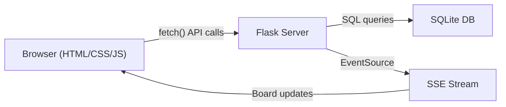

# Architecture

> Update this document when adding new directories, services, data flows, or external dependencies.

## Purpose

Web-based I-PASS/SBAR handoff tool for Emergency Medicine shift teams, capturing structured handoffs and QI metrics for publication.

## System Diagram



## Directory Structure

```
patient-handoff-tracker/
  app/           # Flask backend (routes, models, auth, audit)
  static/        # Frontend assets (css/, js/, img/)
  templates/     # Jinja2 HTML templates
  schema/        # SQL migration files
  scripts/       # DB init, seed, export, anonymize
  tests/         # Pytest suite
  docs/          # Clinical reference documentation
  instance/      # SQLite database (gitignored)
```

## Key Components

| Component | Location | Responsibility |
|-----------|----------|----------------|
| App factory | app/__init__.py | Flask app creation, blueprint registration |
| Database layer | app/db.py | SQLite connection, query helpers, WAL mode |
| Auth system | app/auth.py | Flask-Login session auth, password hashing |
| Audit logger | app/audit.py | HIPAA-compliant append-only access log |
| Patient API | app/routes/patients.py | Patient CRUD endpoints |
| Handoff API | app/routes/handoffs.py | I-PASS/SBAR creation, verification workflow |
| SSE endpoint | app/routes/sse.py | Real-time board updates via Server-Sent Events |
| Metrics API | app/routes/metrics.py | QI dashboard data aggregation + CSV export |

## Data Flow

1. Provider logs in (session cookie set)
2. Board page loads → fetch /api/patients → render patient cards
3. Provider creates handoff → POST /api/handoffs → stored in SQLite
4. SSE broadcasts board update → all connected browsers refresh
5. Receiver acknowledges → verifies with read-back → status updated
6. Metrics auto-captured: timing, completeness, verification status
7. Dashboard aggregates metrics → exportable CSV for QI analysis

## External Dependencies

| Dependency | Purpose | Why this one |
|------------|---------|--------------|
| Flask 3.1 | Web framework | Simplest Python backend, script-like readability |
| Flask-Login | Session auth | 4 functions to implement, browser handles cookies |
| Werkzeug | Password hashing | Bundled with Flask, pbkdf2:sha256 |
| Gunicorn | Production server | Standard Python WSGI, Railway-compatible |
| Chart.js (CDN) | Dashboard charts | Only external JS dependency, for metrics viz |

## Security Boundaries

- All routes behind @login_required (except /auth/login)
- Role-based access: attendings see all, residents see assigned zone
- Audit log on every patient data access (append-only, no DELETE)
- Session cookies: HttpOnly, Secure (prod), SameSite=Lax, 8hr timeout
- No real PHI in development — synthetic data only
- Passwords: werkzeug pbkdf2:sha256 with random salt
