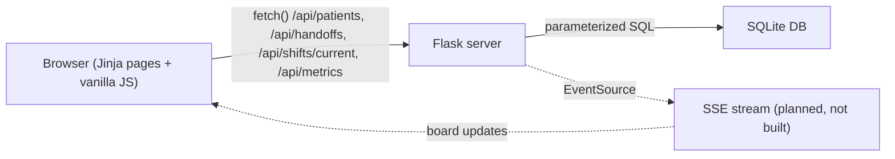

# Architecture

> Update this document when adding new directories, services, data flows, or external dependencies.

## Purpose

Web-based I-PASS/SBAR handoff tool for Emergency Medicine shift teams, capturing structured handoffs and QI metrics for publication.

## System Diagram


```mermaid
graph LR
    Browser["Browser (Jinja pages + vanilla JS)"]
    Flask["Flask server"]
    SQLite["SQLite DB"]
    SSE["SSE stream (planned, not built)"]

    Browser -->|"fetch() /api/patients, /api/handoffs, /api/shifts/current, /api/metrics"| Flask
    Flask -->|"parameterized SQL"| SQLite
    Flask -.->|"EventSource"| SSE
    SSE -.->|"board updates"| Browser
```

## Directory Structure

```
patient-handoff-tracker/
  app/           # Flask backend (app factory, db helpers, auth + User, routes/)
  static/        # Frontend assets (css/, js/)
  templates/     # Jinja2 HTML templates + partials/
  schema/        # SQL schema, indexes, and seed_data.sql (run by the app on an empty DB)
  scripts/       # DB init and seed
  tests/         # Pytest suite
  docs/          # screenshots
  instance/      # SQLite database (gitignored)
```

## Key Components

| Component | Location | Responsibility |
|-----------|----------|----------------|
| App factory | app/__init__.py | Flask app creation, blueprint registration, page routes, auto-seed |
| Database layer | app/db.py | SQLite connection, query helpers, WAL mode |
| Auth system | app/auth.py | Flask-Login session auth, password hashing |
| Patient API | app/routes/patients.py | Patient CRUD endpoints |
| Handoff API | app/routes/handoffs.py | I-PASS/SBAR creation, send, acknowledge, verify, action items; writes audit_log rows inline |
| Shift API | app/routes/shifts.py | Latest shift by start_time (not a clock check) + its team; one source for the board strip, the roster and the receiver list |
| Metrics API | app/routes/metrics.py | QI dashboard data aggregation + CSV export |
| Page shell | templates/base.html + templates/partials/ | Header tabs, shared head (fonts, icon, chart.css), routing / severity / footer partials; login.html stands alone and only includes partials/head.html |
| Stylesheets | static/css/ | Edition 2 "Chart Tab": chart.css (tokens, base, components, roster, metrics, login), board.css (chart rack), sheet.css (forms + view), print.css (letter sheet) |
| Scripts | static/js/ | api.js (fetch wrapper), common.js (acuity map, esc, UTC clock, patient label, shift cache, binder index, receivers), board.js, sheet-form.js (I-PASS and SBAR), handoff-view.js |
| Tests | tests/ | pytest with a fresh seeded DB per test (conftest.py) |

Not built yet (named in earlier plans): app/audit.py (an @audit decorator; audit rows are written inline today) and app/routes/sse.py (real-time board).

## Data Flow

1. Provider logs in (session cookie set)
2. Board loads /api/patients, /api/patients/stats and /api/shifts/current, renders one folder per patient
3. Sender writes an I-PASS or SBAR handoff, names a receiver from the shift team, POST /api/handoffs (draft or sent); a draft can be sent later from the view with POST /api/handoffs/<id>/send
4. Only the named receiver sees the read-back form; acknowledge + verify are enforced server-side to that receiver
5. Metrics auto-captured: timing, completeness, verification status
6. Dashboard aggregates metrics, exportable CSV for QI analysis

All stored timestamps are UTC (SQLite datetime('now')); the seed follows the same convention and the browser shows local time.

## External Dependencies

| Dependency | Purpose | Why this one |
|------------|---------|--------------|
| Flask 3.1 | Web framework | Simplest Python backend, script-like readability |
| Flask-Login | Session auth | 4 functions to implement, browser handles cookies |
| Werkzeug | Password hashing | Bundled with Flask, pbkdf2:sha256 |
| Gunicorn | Production server | Standard Python WSGI; runs the app on Render |
| Chart.js (CDN) | Dashboard charts | Only external JS dependency, for metrics viz |
| Google Fonts | IBM Plex Sans, IBM Plex Sans Condensed, Azeret Mono | Edition 2 type; system fonts are the fallback |

## Security Boundaries

- Every /api route and page is behind @login_required except POST /auth/login and GET /login
- Role-based access: attendings see all, residents see assigned zone (planned; not enforced yet)
- Audit log: handoff view, create, update, send, acknowledge, verify and action-complete write audit_log rows. Patient routes and handoff/action list reads do not yet (known gap, see open work)
- Session cookies: HttpOnly, SameSite=Lax, 8 h PERMANENT_SESSION_LIFETIME. Known gaps: SESSION_COOKIE_SECURE is not set, and login uses remember=True, whose 365-day remember cookie outlasts the 8 h shift rule
- SECRET_KEY comes from the environment (Render generates it); the source still carries a fallback key (known gap)
- No real PHI in development: synthetic data only
- Passwords: werkzeug pbkdf2:sha256 with random salt

## Configuration

| Setting | Where | Notes |
|---------|-------|-------|
| SECRET_KEY | env (render.yaml generates it) | session signing |
| DATABASE_PATH | env, default instance/handoff.db | tests point it at a temp file |
| .env.example | repo root | local development template |

On startup the app creates the schema and, if the users table is empty, seeds 4 demo users plus schema/seed_data.sql (Render's filesystem is ephemeral, so every deploy starts from the seed). scripts/seed_db.py is a separate local path that also adds an admin user.
